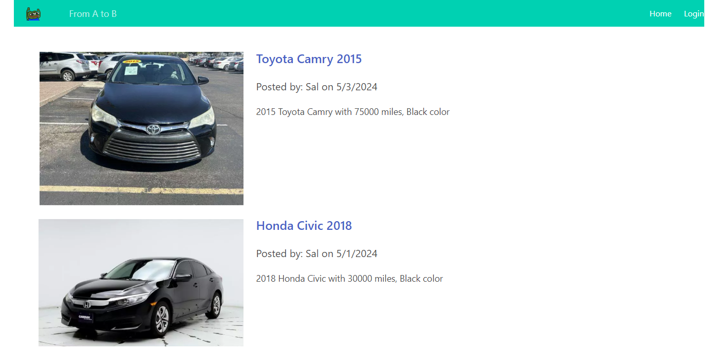

# From A to B

A used car eCommerce site where users can login and browse posts for cars that are for sale and comment on the posts.

## Table of Contents

1. [Installation](#installation)
2. [Usage](#usage)
3. [Features](#features)
4. [API Endpoints](#api-endpoints)
5. [Database Schema](#database-schema)
6. [Contributing](#contributing)
7. [License](#license)
8. [Contact](#contact)

## Installation

### Prerequisites

- Node.js
- PostgreSQL
- Sequelize
- Cloudinary
- Handlebars.js
- Express.js (express-session)
- dotenv
- Bcrypt

### Clone the Repository

```bash
git clone https://github.com/hunterthompson025/From_A_to_B.git
cd your-repo
```

### Install Dependencies

```bash
npm install
```

### Set Up Environment Variables

Create a `.env` file in the root directory and add the following:

```
DB_NAME='name_of_db'
DB_USER='db_user'
DB_PASSWORD='db_password'
SECRET='secret_key'
```

### Seed the Database

```bash
npm run seed
```

### Start the Server

```bash
npm start
```

The server should now be running at `http://localhost:3001`.

## Usage

Homepage



## Features

- Users can create accounts.
- Users can comment on car posts.

## API Endpoints

### Car Routes (/api/cars)

- `GET /`: Get all cars
- `GET /:id`: Get a specific car by ID
- `GET /:id/comments`: Post to add a comment to a car post

### User Routes (/api/users)

- `GET /`: Get all users
- `POST /`: Create a new user
- `POST /login`: Login
- `POST /logout`: Logout

### Example Endpoint

```http
GET /example
```

#### Request to Get All Cars

```bash
curl -X GET http://localhost:3001/api/cars
```

## Database Schema

### 'Car' Model

| Column      | Data Type | Constraints                              |
|-------------|-----------|------------------------------------------|
| id          | INTEGER   | PRIMARY KEY, AUTO_INCREMENT              |
| title       | STRING    | NOT NULL                                 |
| price       | DECIMAL   | NOT NULL                                 |
| description | TEXT      | NOT NULL                                 |
| image_URL   | STRING    |                                          |
| date_created| DATE      | NOT NULL                                 |
| user_id     | DATE      | NOT NULL, FOREIGN KEY REFERENCES user(id)|

### 'User' Model

| Column      | Data Type | Constraints                            |
|-------------|-----------|----------------------------------------|
| id          | INTEGER   | PRIMARY KEY, AUTO_INCREMENT            |
| name        | STRING    | NOT NULL                               |
| email       | STRING    | NOT NULL, UNIQUE, must be an email     |
| password    | STRING    | NOT NULL, must be at least 8 chars long|

### 'Comment' Model

| Column      | Data Type | Constraints                             |
|-------------|-----------|-----------------------------------------|
| id          | INTEGER   | PRIMARY KEY, AUTO_INCREMENT             |
| comment_text| TEXT      | NOT NULL                                |
| car_id      | STRING    | NOT NULL, FOREIGN KEY REFERENCES car(id)|
| user_id     | STRING    | NOT NULL, FOREIGN KEY REFERENCES car(id)|

## Contributing

1. Fork the repository
2. Create a new branch (`git checkout -b feature-branch`)
3. Commit your changes (`git commit -m 'Add some feature'`)
4. Push to the branch (`git push origin feature-branch`)
5. Open a pull request

## License

This project is licensed under the MIT License - see the [LICENSE](LICENSE) file for details.

## Contact

- **Your Name**
- **Email**: your.email@example.com
- **GitHub**: [yourusername](https://github.com/yourusername)

Feel free to reach out if you have any questions or need further assistance!